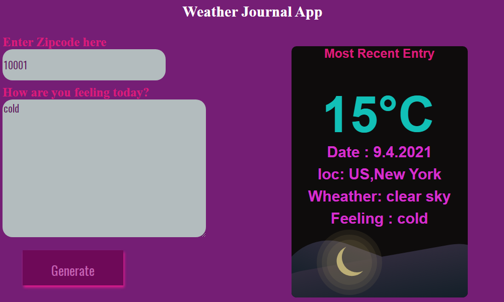

# Weather-Journal App Project

## NAME: Menna Mohsen Saad
## Track: Professional Track 

## Table of Contents

*  project Introduction.
*  Project Environment Setup.
*  APIs and Routes.
*  Dynamic UI
*  Instructions.

## project Introduction
  ### This project aims to create an asynchronous web app that uses Web API and user data to dynamically update the UI for a Weather-Journal App.

## Project Environment Setup
 *  **Node and Express Environment** :-Node and Express  installed on the local machine.The Express app instance pointed to the project folder with .html, .css, and .js files.

 * **Local Server** :-  Local server  running and producing feedback to the Command Line through a working callback function.

 *  **API Credentials** :- API credentials on OpenWeatherMap.com.
     

 ##    APIs and Routes.
 *  **APP API Endpoint**:- There  a JavaScript Object named projectData initiated in the file `server.js` to act  as the app API endpoint.
    

*   **Integrating OpenWeatherMap API**:- the personal API Key for OpenWeatherMap API is saved in variable  and The API Key variable is passed as a parameter to fetch().Data is successfully returned from the external API.
   

*  **Return Endpoint Data GET Route I: Server Side**:-  a GET route setup on the server side with the first argument as a string naming the route, and the second argument a callback function to return the JS object created at the top of server code.
   

* **Return Endpoint Data GET Route II: Client Side**:-  an asynchronous function is used to fetch the data from the app endpoint.
    
*  **POST Route**:- add an entry to the project endpoint using a POST route setup on the server side and executed on the client side as an asynchronous function.The client side function  take two arguments, the URL to make a POST to, and an object holding the data to POST.The server side function create a new entry in the apps endpoint consisting of the data received from the client side POST.
    

##  Dynamic UI
* **Event Listeners**:- an event listener to an existing HTML button from DOM using Vanilla JS.
In the file `app.js`, the element with the id of generate should have an `addEventListener()` method called on it, with click as the first parameter, and a named callback function as the second parameter.

*  **Dynamically Update UI** :- Set the properties of existing HTML elements from the DOM using Vanilla JavaScript.
Included in the async function to retrieve that app’s data on the client side, existing DOM elements should have their innerHTML properties dynamically set according to data returned by the app route.

   

## Instructions
  to run server you need  to install  express,cors, body-parser  package  ,this all define on `package.json` file so 
  * Run  `npm inatall` command line in terminal of right directory of project to install needed package.
  * Run server by `npm start` command line.
  * Go to broswer and on `http://localhost:8080/` The server will run APP.

